<!-- Terminal Header: Contribution Graph -->
<h3><code>ffzlucky7-coder@github ~ $ ./contributions.sh</code></h3>

  

<!-- Terminal Header: Whoami -->
<h3><code>ffzlucky7-coder@github ~ $ whoami</code></h3>

<table>
  <tr>
    <td valign="top" align="center">
      
    </td>
    <td valign="top" align="center">
      
    </td>
  </tr>
</table>

 

<!-- Tech Stack Badges -->
<h3><code>ffzlucky7-coder@github ~ $ cat stack.json</code></h3>

  
  
  
  
  
  
  
  

 

<!-- Social & Connect -->
<h3><code>ffzlucky7-coder@github ~ $ ./connect.sh</code></h3>

  
  

 

---
<i>⚡ Auto-refreshed daily via GitHub Actions | Powered by SVG SMIL & CSS keyframes</i>

